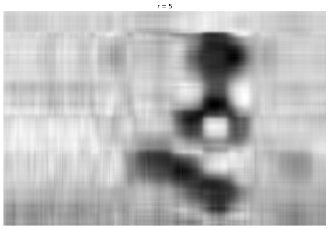

# SVD: Image Compression

Hy, my name is **Jônatas Alves**, i’m beginner in the field of DataScience and IA, but i believe this is a good starting point. 
this code i learned this code from a Steve Bruton yotube video.

Link: [SVD: Image Compression [Python] - YouTube](https://www.youtube.com/watch?v=H7qMMudo3e8)

And in this video Steve teaches how it works a compression of images through SVD (Singular Value Decomposition). 

## First Step

```python
from matplotlib.image import imread
import matplotlib.pyplot as plt
import numpy as np
import os 
plt.rcParams['figure.figsize'] = [16, 8]

A = imread('/content/drive/MyDrive/SVD/dog.jpg')
X = np.mean(A, -1); # Convert RGB to grayscale 

img = plt.imshow(256-X)
img.set_cmap('gray')
plt.axis('off')
plt.show()
```

<p>In the first step we do some imports in code, like the numpy, lib responsible for helping us with some calculations. 
Soon after we do the imports, we got a picture and convert it for grayscale and so through of lib matplotlib we can show a image in project, giving the following result.</p>


## Second Step

```python
U, S, VT = np.linalg.svd(X, full_matrices=False)
S = np.diag(S)

j = 0 
for r in (5, 20, 100):
    # Construct Approximate image
    Xapprox = U[:,:r] @ S[0:r,:r] @ VT[:r,:]
    plt.figure(j+1)
    j += 1
    img = plt.imshow(256-Xapprox)
    img.set_cmap('gray')
    plt.axis('off')
    plt.title('r = ' + str(r))
    plt.show()
```

Now I Actually started using the SVD, in first line I take the ***U*** what is a Unity Matrix, and take too the *sigma*, but in code is a ***S*** which is a rectangular matrix that soon after we will pick up its singular values, and finally take the VT which is the transposed conjugate.     
In this step we can see too the construction approximate of image in three ranks (5, 20, 30) how bigger the closer it gets to the original image, and again show image in project, giving the following result.



